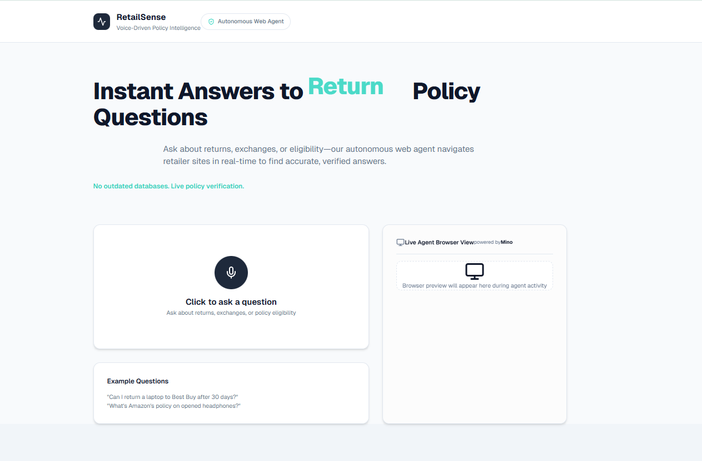

## RetailSense - Voice-First Retail Policy Intelligence

### Overview

RetailSense is an autonomous AI agent designed to answer complex retail policy questions in real-time. By utilizing autonomous browser reasoning, it navigates live retailer websites to verify return, exchange, and price-match policies, providing source-backed answers with a conversational Australian personality.

(Webpage Preview Screenshot Placeholder)



### 1. Goal (query)

```
You are an expert retail policy researcher. Your goal is to find the most accurate and up-to-date policy information for a specific retailer.

CURRENT DATE AND TIME: Friday, January 17, 2026, 10:10 AM

STEP 1 - IDENTIFY INTENT:
Extract the retailer, product category, and specific policy type (e.g., Return, Exchange, Price Match) from the user's query.

STEP 2 - LIVE WEB NAVIGATION:
- Navigate to the official retailer's website.
- Locate the 'Help', 'Customer Service', or 'Returns' section.
- Search for the specific product category (e.g., Electronics, Apparel) if policies differ.

STEP 3 - POLICY EXTRACTION & REASONING:
- Find the specific time window (e.g., 30 days, 90 days).
- Identify critical exceptions (e.g., "Must be in original packaging", "Excludes final sale").
- Verify the policy for the specific purchase channel (Online vs. In-Store).

STEP 4 - RETURN STRUCTURED RESULT:
{
  "retailer": "Name of the retailer",
  "policy_found": true/false,
  "time_window": "30 Days",
  "verified_sources": ["URL 1", "URL 2"],
  "conversational_summary": "Aussie-accented summary of the findings"
}
```

---

### 2. Code Snippets

### cURL

```bash
curl -X POST "http://localhost:3000/api/analyze" \
  -H "Content-Type: application/json" \
  -d '{
    "text": "Can I return a laptop to Best Buy after 15 days?"
  }'
```

### TypeScript (Analysis Request)

```tsx
const response = await fetch("/api/analyze", {
  method: "POST",
  headers: {
    "Content-Type": "application/json",
  },
  body: JSON.stringify({
    text: "What is Amazon's policy on opened headphones?",
  }),
});

const data = await response.json();

if (data.result) {
  console.log("Intent:", data.intent);
  console.log("Reasoning Activities:", data.activities);
  console.log("Verified Result:", data.result);
}
```

### Python

```python
import requests

url = "http://localhost:3000/api/analyze"
payload = {
    "text": "Does Walmart price match Amazon for televisions?"
}

response = requests.post(url, json=payload)
data = response.json()

print(f"Retailer: {data['intent']['retailer']}")
print(f"Answer: {data['result']['answer']}")
print(f"Aussie Reply: {data['result']['conversational_reply']}")
```

---

### 3. Sample Streaming Output

```
data: {"type":"STATUS","message":"Navigating to Best Buy's official website..."}

data: {"type":"STATUS","message":"Locating return policy for Electronics..."}

data: {"type":"STATUS","message":"Analyzing purchase channel exclusions..."}

data: {"type":"STATUS","message":"Extracting verified evidence for Best Buy..."}

data: {"type":"COMPLETE","result":{"answer":"Yes","reason":"Best Buy typically allows returns for electronics within 15 days, though Elite members get longer.","conversational_reply":"No worries mate! I've checked the Best Buy policy for ya. Since you're at 15 days, you're right on the limit. Just make sure you've got the tags on, and you'll be right as rain!"}}
```

---

### Key Features

| Feature | Description |
| --- | --- |
| **Voice Interaction** | Record queries directly and hear responses narrated in a male Australian accent. |
| **Autonomous Reasoning** | Navigates live DOM elements rather than relying on static, outdated RAG databases. |
| **Full Transparency** | Real-time "Browser Preview" shows every step the agent takes during navigation. |
| **Source Verification** | Every answer includes direct links to official retailer help pages for user verification. |

### Architecture Overview

```
┌─────────────────────────────────────────────────────────────────┐
│                         USER INTERFACE                           │
│                 (Next.js 15 + Vanilla CSS + Framer)              │
└─────────────────────────────────────────────────────────────────┘
                                │
                                ▼
┌─────────────────────────────────────────────────────────────────┐
│                      Intelligence Layer                          │
│                   (api/analyze - Orchestration)                  │
└─────────────────────────────────────────────────────────────────┘
            │                    │                    │
            ▼                    ▼                    ▼
┌──────────────────┐  ┌──────────────────┐  ┌──────────────────┐
│    WHISPER-1     │  │      GPT-4o      │  │      MINO        │
│    (Speech)      │  │    (Intent)      │  │   (Automation)   │
│                  │  │                  │  │                  │
│ - Transcribe     │  │ - Extract Entity │  │ - Navigate Web   │
│ - Audio to Text  │  │ - Map Category   │  │ - Verify Policy  │
│ - High Accuracy  │  │ - Format JSON    │  │ - Interactive    │
└──────────────────┘  └──────────────────┘  └──────────────────┘
```

### Component Relationships

| Component | Role | Logic |
| --- | --- | --- |
| **VoiceRecorder** | Captures user audio and manages visualizer state | `MediaRecorder API` |
| **Analyze API** | Orchestrates intent extraction and agent dispatch | `OpenAI + Mino SDK` |
| **BrowserPreview**| Displays real-time reasoning steps to the user | `State-driven list` |
| **SpeechService** | Narrates results with a custom Aussie persona | `Web Speech API (en-AU)` |

### Data Flow

1. **Voice Input** → User speaks query (e.g., "Can I return this at Target?")
2. **Transcription** → Whisper-1 converts audio blob to text transcript.
3. **Intent Extraction** → GPT-4o parses text into structured retail JSON (Retailer, Policy Type, etc.).
4. **Agent Dispatch** → Mino Agent navigates the live retailer website dynamically.
5. **Live Status** → Real-time updates bridge the navigation steps to the UI dashboard.
6. **Result Generation** → Agent extracts policy text and formats a verified response.
7. **Persona Output** → Web Speech API speaks the result with an Australian accent.

---

### Original Prompts

The core vision for RetailSense was:

> Build an autonomous retail policy researcher:
> 
> - Support voice-first interaction with real-time transcription.
> - Use GPT-4o to understand complex retail intents from natural language.
> - Deploy a Mino browser agent to browse official help pages for live verification.
> - Show a transparent "Live View" of the agent's reasoning steps.
> - Narrate results using an Aussie persona to make policy information more engaging.
> - Ensure every answer is backed by official sources to prevent AI hallucinations.
