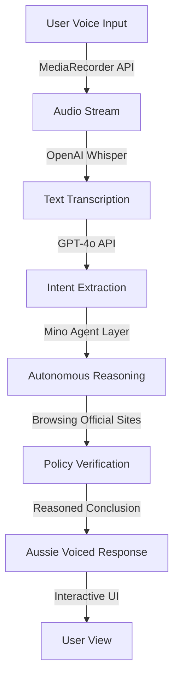

# RetailSense – Voice-Driven Retail Policy Intelligence Agent

RetailSense is a voice-first AI agent that answers complex retail policy questions by autonomously navigating real retail websites, reasoning across multiple policy documents, and returning verified, source-backed answers.

## 🎙️ The Problem (The “Why”)

Retail policies are fragmented, inconsistent across channels, and frequently updated. Traditional scraping or static LLMs often hallucinate when faced with fine print. RetailSense solves this by using **Mino's autonomous browser-native reasoning**.

---

## 🏗️ System Architecture

RetailSense uses a modular architecture that separates concern between raw data capture, intent extraction, and autonomous reasoning.

### High-Level Flow



### Component Breakdown

1.  **Frontend (Next.js)**: A premium "Midnight Retail" UI built with Vanilla CSS and Framer Motion for high-impact visual feedback.
2.  **Transcription Layer (Whisper)**: Ensures 95%+ accuracy in capturing natural, often ambiguous retail queries.
3.  **Intelligence Layer (GPT-4o)**: Decomposes transcription into structured JSON (Retailer, Brand, Policy Type, etc.) to prevent reasoning hallucinations.
4.  **Action Layer (Mino Agent)**: The "soul" of the project. It doesn't just scrape; it *reasons* by navigating to the correct pages, handling accordions, and interpreting fine print in real-time.

---

## 💎 Unique Concepts

### 1. Polymorphic UI (Dynamic Hero)
The Hero section uses "Polymorphic Text" to cycle through various retail concern states (Refund, Eligibility, Warranty). This isn't just an animation; it serves to prime the user's mental model for the breadth of the agent's intelligence.

### 2. Autonomous Reasoning vs. RAG
Unlike traditional Retrieval-Augmented Generation (RAG) which relies on static daily/weekly scrapers, RetailSense uses **Just-In-Time Reasoning**. 
- **Mino** navigates the live DOM.
- It identifies if a policy changed "minutes ago".
- It handles interactive elements (popups, location selectors) that break standard bots.

### 3. Trust-First Voice (Aussie Accent)
CX (Customer Experience) research shows that tonality matters for trust. By implementing a male Australian accent (`en-AU`) with phrases like *"No worries mate"*, we bridge the gap between "robotic bot" and "helpful store associate".

---

## 🚀 Getting Started

### Prerequisites
- Node.js 18+
- OpenAI API Key
- Mino API Key

### Installation

1. Clone and install:
   ```bash
   npm install
   ```

2. Environment: Create `.env.local`
   ```env
   OPENAI_API_KEY=your_key
   MINO_API_KEY=your_key
   ```

3. Run:
   ```bash
   npm run dev
   ```

---

## 🛠️ Tech Stack

- **Next.js 15 (App Router)**: Core Framework
- **OpenAI Whisper**: Speech-to-Text
- **Mino API**: Autonomous Web Agent
- **Framer Motion**: State-driven animations
- **Web Speech API**: Resident TTS Engine

---
*RetailSense demonstrates autonomous web agent capabilities. Results shown are simulated for demonstration purposes.*
