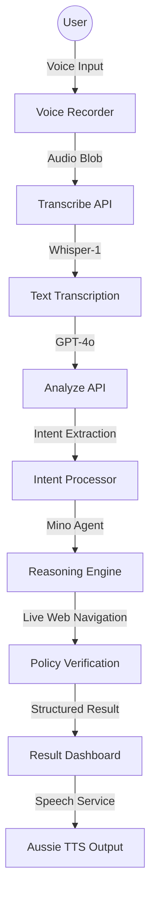
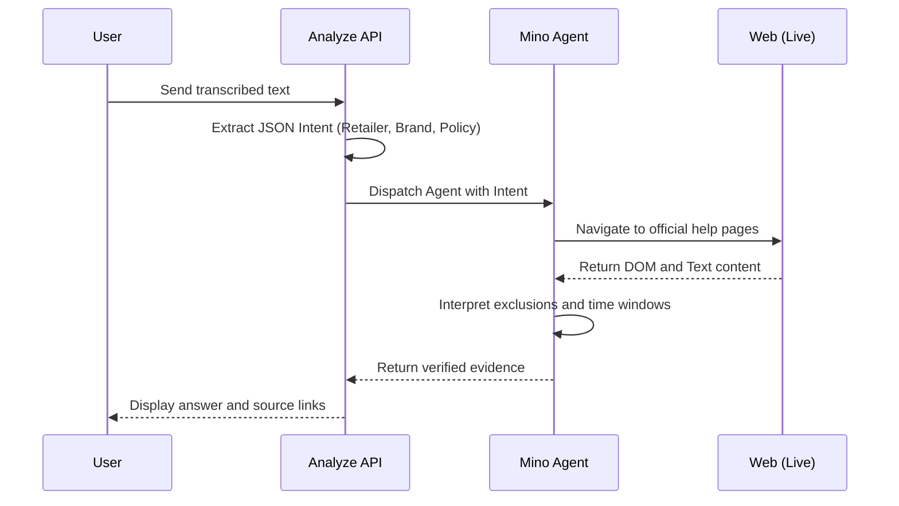
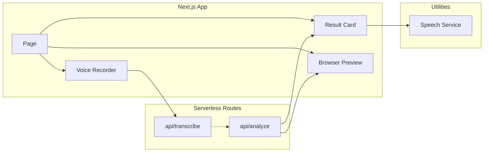

# RetailSense Case Study: Voice-First Retail Intelligence

RetailSense is a project that implements autonomous browser reasoning. It allows users to ask retail policy questions via voice and receive verified answers by navigating live websites in real-time.

## High Level System Architecture

The following diagram illustrates the end-to-end data flow from user voice input to the final Aussie-voiced response.



## Reasoning Pipeline

Unlike traditional RAG systems that search a pre-indexed database, RetailSense uses Just-In-Time reasoning to ensure data freshess.



## Component Structure

The frontend is built with Next.js 15 and communicates with several specialized layers.



## Core Implementation Details

### Voice Recorder
Uses the MediaRecorder API to capture audio. A real-time visualizer provides feedback during the recording phase.

### Intelligence Layer
GPT-4o converts natural language into structured JSON. This JSON specifies the retailer, product category, and policy type.

### Mino Agent Layer
The agent navigates to the live DOM of the retailer website. It handles interactive elements like accordions or popups to find the specific policy details.

### Speech Service
Uses the Web Speech API with a male Australian accent. The response generation includes regional vernacular to maintain a consistent persona.

## Tech Stack

* Framework: Next.js 15
* Speech-to-Text: OpenAI Whisper-1
* Reasoning: GPT-4o and Mino API
* TTS: Web Speech API (en-AU)
* UI: Vanilla CSS and Framer Motion

## Local Setup

1. Install dependencies:
   ```bash
   npm install
   ```

2. Configure .env.local:
   ```env
   OPENAI_API_KEY=your_openai_key
   MINO_API_KEY=your_mino_key
   ```

3. Start the server:
   ```bash
   npm run dev
   ```
